# CASE-004 — Tunneling in Plain Sight: Detecting DNS C2 with Zeek and Splunk
   
## What This Lab Is About

I built this lab to simulate a real DNS tunneling attack and then catch it using behavioral detections in Splunk. The goal was to understand not just how dnscat2 works, but what it looks like on the wire — and how to write detections that would catch it regardless of how an attacker deployed it.

By the end of the lab I had a root shell on the victim machine delivered entirely over DNS, and three independent Splunk detections that flagged it. No signatures. No IOC matching. Just behavior.

**MITRE ATT&CK Techniques:**
- T1071.004 — Application Layer Protocol: DNS
- T1048.003 — Exfiltration Over Unencrypted DNS
- T1572 — Protocol Tunneling

---

## Lab Environment

| VM | Role | IP |
|---|---|---|
| Kali Linux | Attacker — dnscat2 server | 192.168.122.3 |
| dns-tunnel-victim | Victim — dnscat2 client | 192.168.122.13 |
| Ubuntu Server (robertserver) | Zeek sensor + Splunk forwarder | 192.168.122.7 |
| Splunk Indexer | SIEM — detection and analysis | 192.168.122.11 |

All VMs run on VirtualBox. The subnet is 192.168.122.0/24. Zeek sits passively on robertserver, capturing everything on the network and shipping parsed DNS logs to Splunk via the Universal Forwarder.

**Tools:**
- dnscat2 v0.07 — DNS tunneling framework
- Zeek — network security monitor, produces structured dns.log
- Splunk Enterprise 10.2 — SIEM and detection platform
- Splunk Universal Forwarder — ships Zeek logs from robertserver to the indexer

---

## The Attack Chain

### Step 1 — dnscat2 server on Kali

I started the dnscat2 Ruby server on Kali. It listens on UDP port 53 and waits for the client to call back.

```bash
cd ~/dnscat2/server
sudo ruby ./dnscat2.rb
```

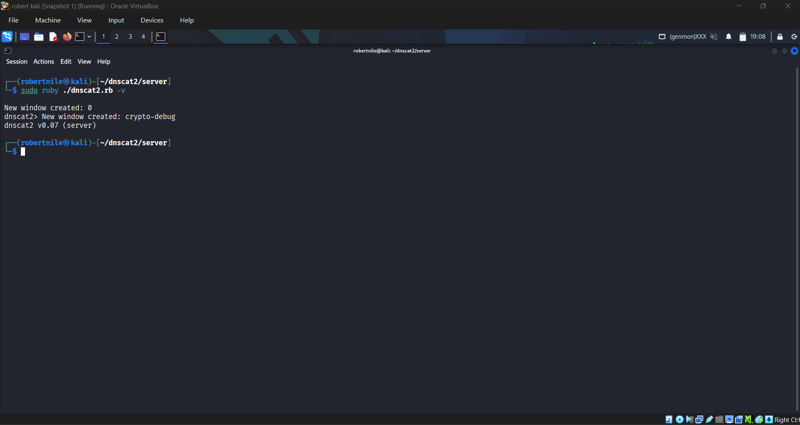

### Step 2 — dnscat2 client on the victim

I compiled and installed the dnscat2 C client on the victim VM (192.168.122.13).

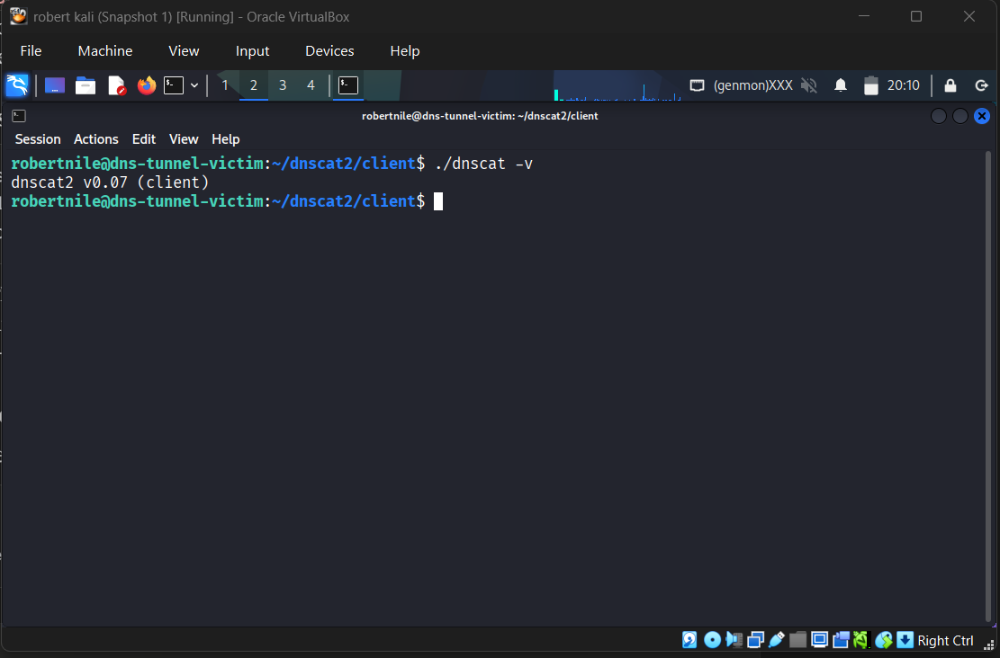

### Step 3 — Tunnel established

The client connected back to Kali over UDP port 53, authenticating with a pre-shared secret. Both sides confirmed the session was encrypted and verified.

**Server side — session confirmed:**

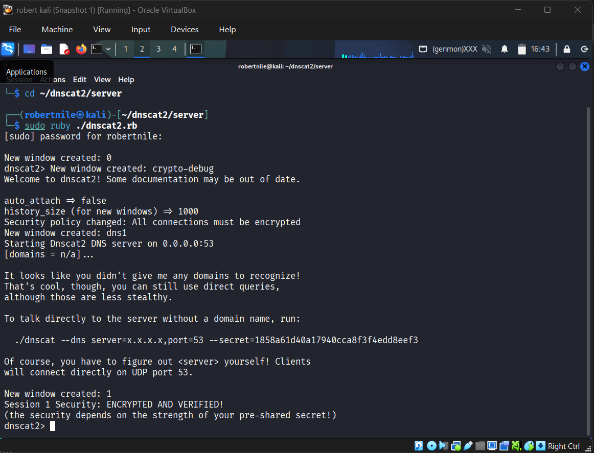

**Victim side — peer verified, session established:**

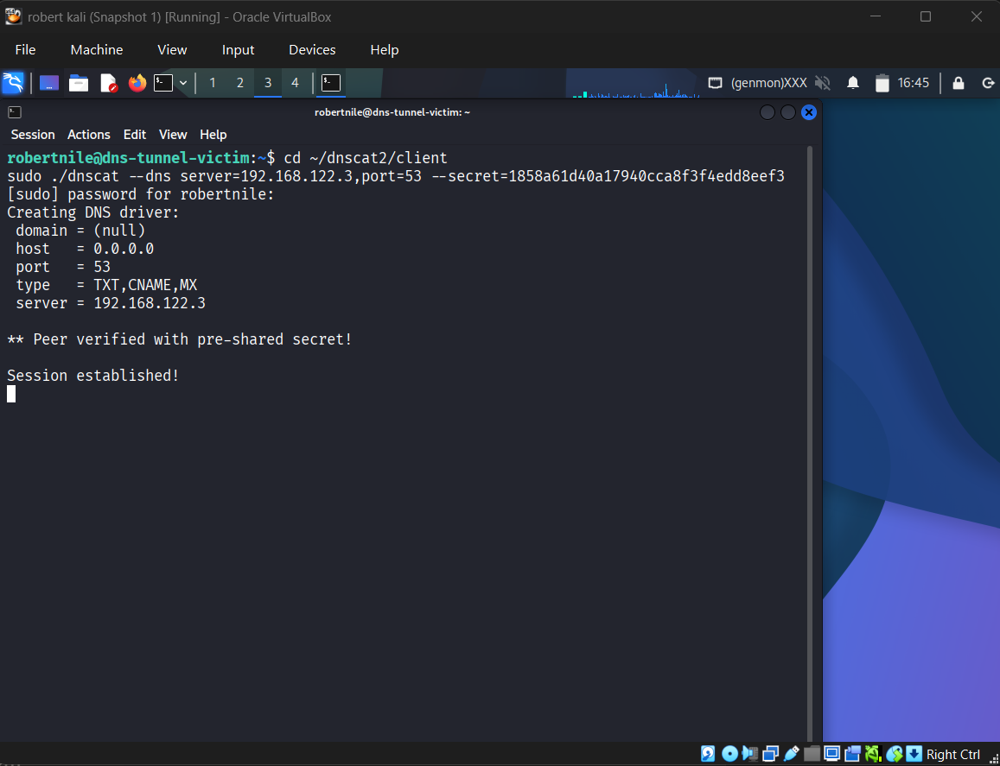

dnscat2 uses TXT, CNAME, and MX record types to carry encoded data inside what looks like normal DNS queries.

### Step 4 — Root shell over DNS

From the dnscat2 console on Kali I opened an interactive shell on the victim. Every command and response traveled through DNS — no direct TCP or UDP connection to the victim ever existed.

```
dnscat2> window -i 2
sh (dns-tunnel-victim) 2> whoami
root
sh (dns-tunnel-victim) 2> id
uid=0(root) gid=0(root) groups=0(root)
```

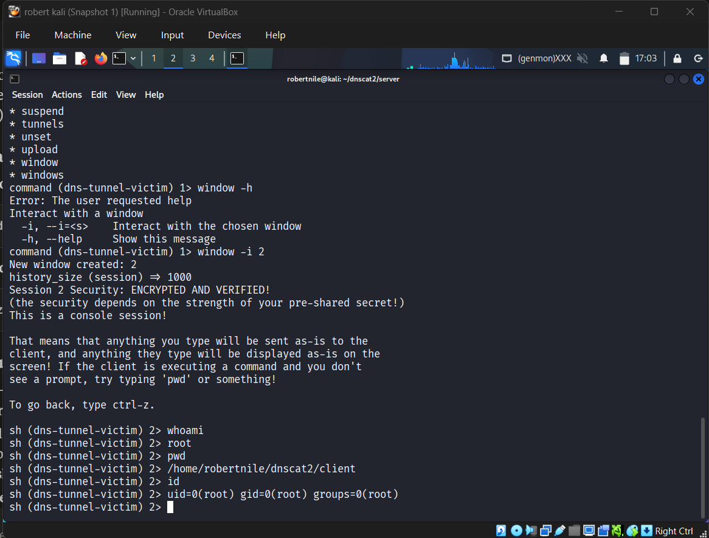

Full root access. Delivered entirely over DNS.

---

## Log Capture

Zeek on robertserver captured the entire attack in real time, writing structured records to `/opt/zeek/spool/zeek/dns.log`. The Universal Forwarder shipped those logs to Splunk as they were written.

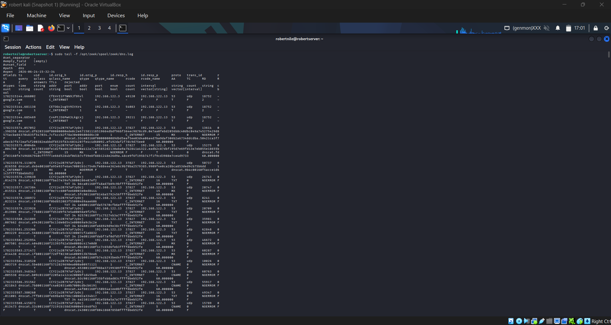

The raw logs show everything — the encoded subdomain payloads, the unusual record types, the rapid-fire query pattern. All from 192.168.122.13.

---

## A Fix I Had to Figure Out — Zeek TSV Field Parsing

Before any detection work was possible I ran into a problem: every Splunk query returned misaligned fields. Field names were shifted one column off from their actual data. After digging into it I found the cause — Splunk was reading the `#fields` header line in Zeek's TSV output as a data row, treating `#fields` itself as the first column name and shifting everything after it by one position.

The fix was adding `FIELD_HEADER_REGEX` to the `[zeek:dns]` stanza in props.conf on the forwarder:

```ini
[zeek:dns]
INDEXED_EXTRACTIONS = TSV
FIELD_DELIMITER = \t
HEADER_FIELD_LINE_NUMBER = 7
FIELD_HEADER_REGEX = ^#fields\t(.*)
```

This tells Splunk to match the line starting with `#fields\t` and strip that prefix before reading the field names. Without it, nothing works correctly.

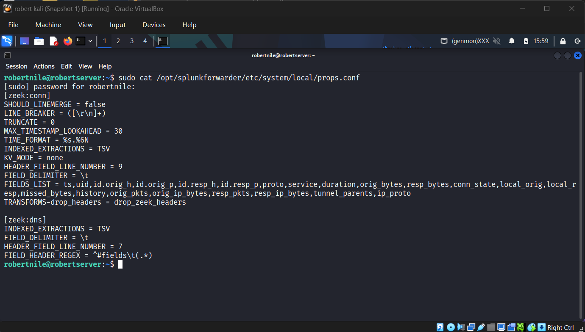

This isn't documented in most Zeek/Splunk integration guides. If you're building a similar setup and your fields look wrong, this is why.

---

## Detections

Here's what Zeek DNS events look like in Splunk once the parsing fix is in place:

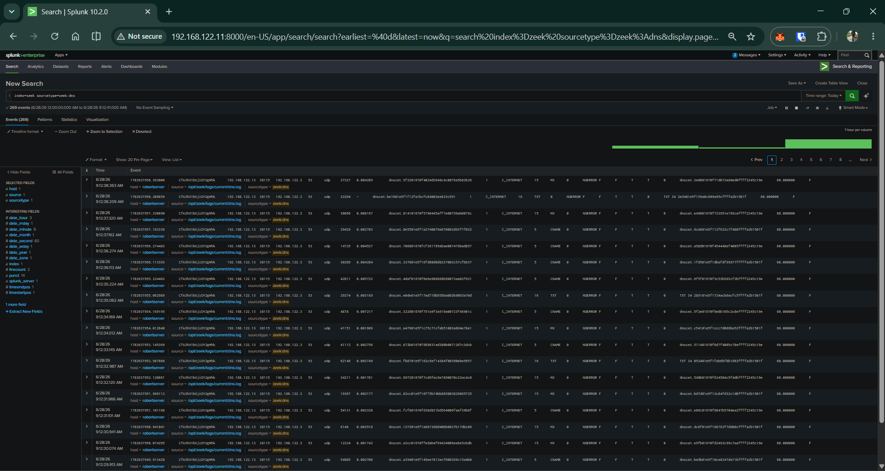

---

### Detection 1 — Unusual DNS Record Types (T1071.004)

dnscat2 uses TXT, MX, CNAME, and NULL record types to carry payload data. Normal DNS traffic is almost entirely A and AAAA queries. A single host generating hundreds of TXT, MX, and CNAME queries is a strong behavioral signal.

```spl
index=zeek sourcetype=zeek:dns
| where qtype_name="TXT" OR qtype_name="MX" OR qtype_name="NULL" OR qtype_name="CNAME"
| stats count by id_orig_h, qtype_name
| sort -count
```

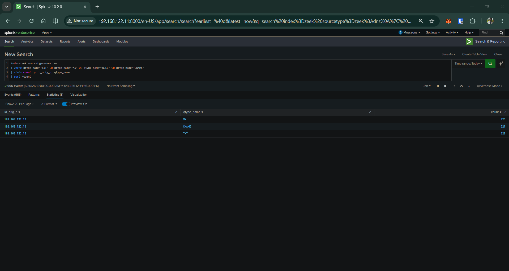

192.168.122.13 generated 225 MX, 221 CNAME, and 220 TXT queries in a single session. No other host on the subnet produced any of these record types. The even distribution across all three types is characteristic of dnscat2 — it rotates between them to carry different parts of the C2 channel.

---

### Detection 2 — Long Encoded Subdomain Length (T1572)

dnscat2 encodes data into DNS query names using hex encoding, packing payloads close to the 63-character DNS label limit. The result is query names far longer than any legitimate hostname.

```spl
index=zeek sourcetype=zeek:dns
| eval qlen=len(query)
| where qlen > 50
| stats count avg(qlen) as avg_len max(qlen) as max_len by id_orig_h, query
| sort -max_len
```


Most queries hit exactly 240 characters — that uniformity tells you dnscat2 is packing data into fixed-size chunks, not variable-length human-typed hostnames.

I also built a length bucket query to show the distribution clearly:

```spl
index=zeek sourcetype=zeek:dns
| eval qlen=len(query)
| where qlen > 50
| eval len_bucket=case(qlen>=200, "200+", qlen>=100, "100-199", qlen>=50, "50-99")
| stats count by id_orig_h, len_bucket
```

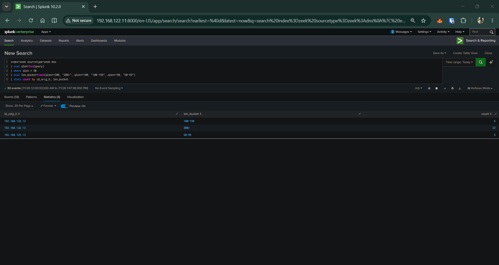

22 of 33 long queries fell in the 200+ bucket. All from 192.168.122.13.

---

### Detection 3 — High-Volume Query Rate (T1048.003)

While the session was active, dnscat2 generated nearly one DNS query every 0.6 seconds — thousands of queries in a two-hour window. No legitimate application behaves this way.

I first ran a diagnostic to see the raw interval values across all hosts:

```spl
index=zeek sourcetype=zeek:dns
| sort 0 id_orig_h, _time
| streamstats current=f last(_time) as prev_time by id_orig_h
| eval delta=_time-prev_time
| where delta > 0
| stats count avg(delta) as avg_interval stdev(delta) as stdev_interval by id_orig_h
| eval coefficient_of_variation=stdev_interval/avg_interval
```

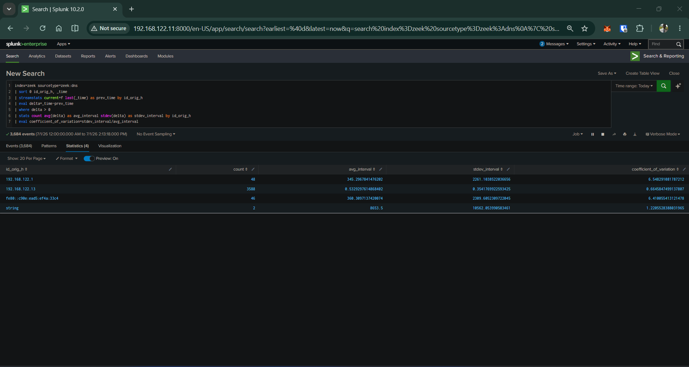

The contrast is stark. 192.168.122.13 sent 3,588 queries at an average interval of 0.53 seconds. Every other host sent 46–48 queries at average intervals of 345–360 seconds — roughly every 6 minutes. Normal background DNS activity.

One thing I had to tune: the coefficient of variation (CV) for 192.168.122.13 came back at 9.45, not the sub-1.0 value typical beaconing detection assumes. That's because dnscat2 in interactive shell mode isn't periodic — it bursts when commands are typed and sits idle between them, which inflates variance. CV works well for scheduled implants. For interactive C2 shells, volume plus average interval is the right signal. I adjusted the final query accordingly:

```spl
index=zeek sourcetype=zeek:dns
| sort 0 id_orig_h, _time
| streamstats current=f last(_time) as prev_time by id_orig_h
| eval delta=_time-prev_time
| where delta > 0
| stats count avg(delta) as avg_interval stdev(delta) as stdev_interval by id_orig_h
| eval coefficient_of_variation=stdev_interval/avg_interval
| where count > 100 AND tonumber(avg_interval) < 5
```

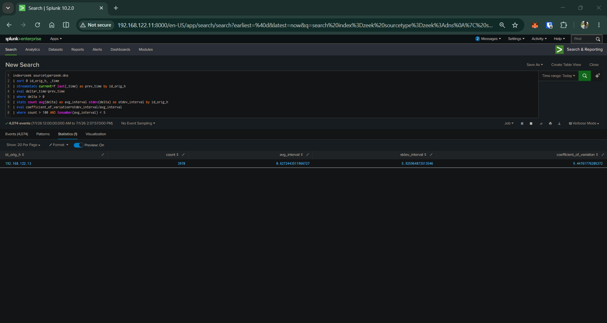

192.168.122.13 isolated cleanly. 3,978 queries, 0.627 second average interval.

> **Note:** `tonumber()` is required around `avg_interval` because Splunk returns `avg()` results as strings after a stats pipeline. Without it, numeric comparisons fail silently and return no results.

---

## Detection Summary

| Detection | Technique | What I looked for | Result |
|---|---|---|---|
| D1 — Unusual record types | T1071.004 | TXT/MX/CNAME queries from a single host | 666 events, 3 record types, 1 source IP |
| D2 — Encoded query length | T1572 | Query names > 50 chars | 22 queries at 240 chars, all from .122.13 |
| D3 — Query rate | T1048.003 | count > 100 AND avg_interval < 5s | 3,978 queries at 0.627s avg, 1 source IP |

---

## Why Behavioral Detection Matters

A question I asked myself while building this lab: in a real attack, how would an attacker make the dnscat2 installation invisible? There are several ways — renaming the binary to look like a legitimate system process, running it directly in memory so nothing touches disk, delivering it through an exploit without a visible install step.

None of those evasion techniques would have helped against these detections. The reason is simple: **the detections are behavioral, not signature-based**. They don't look for a file named dnscat2. They don't match a known IOC. They watch what the tunnel *does* — the record types it uses, the length of its encoded queries, the rate at which it fires. The tunnel has to make DNS queries to function, and the moment it does, the behavior is visible.

This also means the detections are **OS-agnostic**. Zeek sits on the network and sees packets — it doesn't know or care whether the victim is running Linux, Windows, or anything else. The same SPL queries that caught this Linux victim would catch a Windows victim running the dnscat2 PowerShell client, because the network behavior is identical. DNS tunneling looks the same on the wire regardless of the operating system generating it.

Signature-based detection can be evaded. Behavior is much harder to hide.

---

## Limitations

- **Network visibility only.** These detections work at the network layer. Catching the *deployment* of the C2 agent — suspicious processes, unusual file writes, parent process anomalies — requires endpoint visibility through an EDR or agent like Velociraptor (see CASE-002).
- **Interactive vs scheduled C2.** Detection 3 is tuned for interactive shell mode. A slow, low-volume implant checking in once every few minutes would need different thresholds.
- **No threat intel enrichment.** In a production environment, Detection 1 would be strengthened by correlating flagged domains against threat intel feeds.

---

[Full Technical Report (PDF)](CASE-004_Technical_Report.pdf)

## Files

```
CASE-004/
├── README.md
├── screenshots/
│   ├── dns_server_installed_on_kali.png
│   ├── dnscat2_client_installed_on_dns-tunnel-victim.png
│   ├── dnscat2_connected_to_dns-tunnel-victim.png
│   ├── dnscat2_connection_confirmed_by_victim.png
│   ├── props-conf-field-header-fix.png
│   ├── dnscat2-shell-session-root-access.png
│   ├── zeek-dns-log-tunnel-capture.png
│   ├── raw_dnscat2_detection_on_splunk.png
│   ├── splunk-detection-unusual-record-types.png
│   ├── Screenshot_2026-06-30_152307.png
│   ├── D2-query-length-distribution.png
│   ├── beaconing-raw-cv-values.png
│   └── beaconing-confirmed.png
└── playbook/
    └── PB-CASE004.md
```

---

*Part of a home lab portfolio documenting SOC detection engineering. Built on VirtualBox. All detections mapped to MITRE ATT&CK.*
